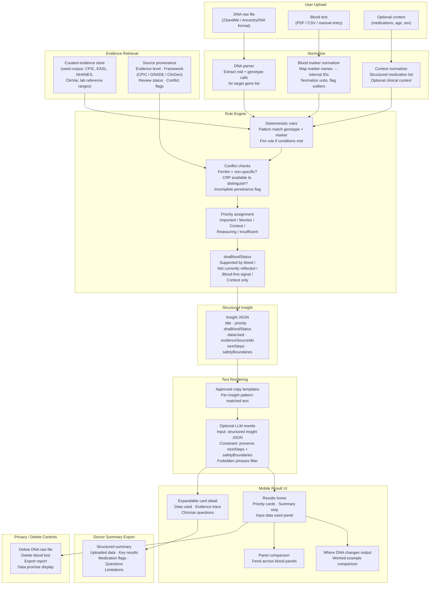

# Architecture Diagram

**Purpose:** Show how user data flows from upload to mobile results, and explain why the architecture is designed the way it is — especially why a rule engine precedes any LLM, and why the MVP starts with hand-curated evidence rather than a full knowledge graph or unconstrained CPIC wrapper.

---

## Pipeline Diagram



---

## Why the Architecture Starts with Hand-Curated Rules

The rule engine is the core of the insight pipeline, not the LLM. This is intentional.

**The problem with LLM-first approaches for medical claims:**

An unconstrained LLM can plausibly synthesize text about any gene-biomarker combination. This creates a product that sounds convincing but may:
- Generate claims not supported by any specific guideline
- Produce inconsistent outputs for the same inputs across sessions
- Fail to distinguish between strong evidence (CPIC Tier 1A) and exploratory associations (single GWAS study)
- Not preserve safety boundaries when rephrasing

**What the rule engine provides:**
- Deterministic behavior: same inputs always produce the same priority classification
- Auditable evidence linkage: every insight traces to a specific source with an evidence level
- Conflict checking: rules can explicitly flag when a marker is non-specific (e.g. ferritin) and require additional context
- Safety boundaries: rules define `nextSteps` and `safetyBoundaries` that the LLM is constrained to preserve, not invent

**What the LLM is allowed to do:**
The LLM receives a fully structured `Insight` JSON as input and rewrites the `plainLanguageSummary` field only. It is not allowed to modify `priority`, `dnaBloodStatus`, `nextSteps`, or `safetyBoundaries`. A forbidden-phrase filter rejects outputs containing language like "you should stop taking", "this confirms you have", or "your DNA causes".

---

## How the Architecture Scales Toward CPIC / PharmGKB / GRADE

The MVP uses a hand-curated seed corpus because:
- Full CPIC and PharmGKB coverage is large; the prototype needs 3–5 high-quality examples
- Curating manually allows exact control over evidence level labeling
- The schema is designed to be compatible with standard evidence frameworks from the start

**Schema fields that enable future scaling:**

```typescript
type EvidenceSource = {
  sourceEvidenceLevel: string;    // e.g. "CPIC 1A", "GRADE high", "ClinGen definitive"
  sourceFramework: string;        // "CPIC" | "PharmGKB" | "GRADE" | "ClinGen" | "ClinVar"
  reviewStatus: string;           // "curated" | "auto-imported" | "pending-review"
  validatedBy?: string;           // curator name / reviewer role
  populationScope?: string;       // e.g. "Northern European" | "pan-ethnic"
  conflictsWith?: string[];       // IDs of conflicting evidence items
};
```

When scaling beyond the seed corpus:
1. Add a reviewer workflow: new evidence items enter as `pending-review` and require sign-off before rules can use them.
2. Preserve source-native levels: do not flatten CPIC 1A and a weak GWAS into the same "strong" category — map them separately.
3. Add conflict resolution logic: when two evidence items conflict, the rule engine surfaces both and defaults to the more conservative output.
4. Use retrieval to surface *candidate* evidence items for curator review, not to auto-generate clinical claims.

---

## Why Not a Pure CPIC Wrapper

CPIC provides excellent pharmacogenomics guidance (CYP2C19, CYP2D6, TPMT, etc.) and is the right source for PGx rules. However:

| Limitation | Impact |
|---|---|
| Coverage is drug-gene focused | Does not cover nutrient, metabolic, or blood-first biomarker signals |
| Does not integrate blood markers | Cannot express rules that combine genotype + current blood values |
| No blood-first signal pathway | Cannot express "ferritin elevated AND HFE genotype → specific question" |
| Structured for clinical implementation | Not designed for direct consumer presentation; requires translation layer |

**Decision:** Use CPIC as the source layer for PGx rules (CYP2C19 + clopidogrel is directly CPIC-sourced). Extend the rule engine for non-PGx pathways (HFE + ferritin, MTHFR + homocysteine) using other curated sources.

---

## Why Not a Full Typed Knowledge Graph at MVP

A typed knowledge graph (nodes = genes, biomarkers, diseases, drugs; edges = evidence-weighted relationships) is the long-term target architecture. It handles provenance, conflicts, and population scope naturally.

| Trade-off | Assessment |
|---|---|
| More expressive for complex relationships | True; but 3–5 seed examples don't require graph traversal |
| Better conflict resolution at scale | True; but hand-curation handles conflicts for MVP |
| Higher engineering overhead | A graph DB + traversal engine adds meaningful scope for a 2.5-month prototype |
| Schema must be graph-compatible from the start | **This constraint is applied:** the flat JSON schema uses IDs and arrays that can migrate to a graph |

**Decision:** Accept flat typed JSON schema for the planning prototype. The `conflictsWith`, `evidenceSourceIds`, and `dataUsed` arrays are designed to map cleanly onto graph edges. The schema migration path is documented and preserved.

---

## Alternatives Considered

| Approach | Strength | Limitation | Decision |
|---|---|---|---|
| CPIC / PharmGKB wrapper | Clinically grounded PGx; strong evidence hierarchy | Medication-gene only; no blood integration | Use as PGx source layer, not full architecture |
| Typed knowledge graph | Scales provenance and conflict resolution naturally | Engineering overhead exceeds 2.5-month MVP scope | Long-term target; schema designed to migrate |
| Flat typed JSON schema | Fast to prototype; inspectable; easy for UI | Hand-curated; limited scale | Accept for MVP with migration path documented |
| RAG over medical literature | Broad coverage; low curation burden | Weak clinical defensibility; inconsistent evidence levels | Retrieval for curator candidate surfacing only — not the recommendation engine |
| Unconstrained LLM | Fast content generation | No deterministic evidence linkage; safety boundary not guaranteed | Constrained rewrite only; never the primary evidence source |

---

## Privacy Architecture Note

All user data (DNA raw file, blood test) is treated as sensitive from the moment of upload:
- Files stored with encryption at rest
- Raw files deletable by user at any time, independently of derived insights
- Insights and reports also deletable
- No data sold; no training on identifiable user data without explicit consent
- Privacy controls are a core product screen, not a legal footer

This is not implemented in the current prototype (no backend), but the architecture must support it from Phase 1 of the actual build.
