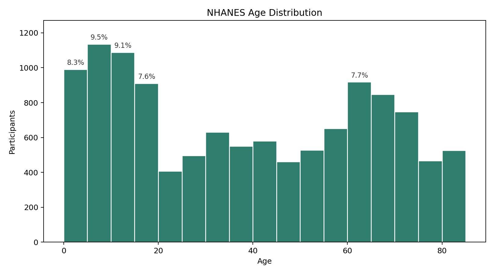
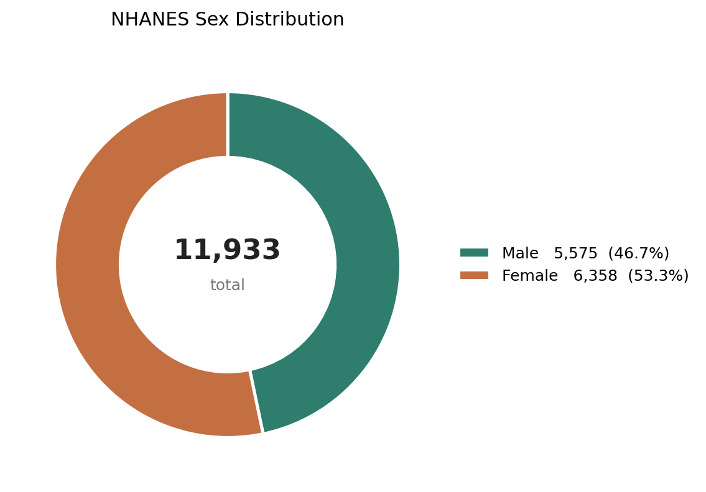
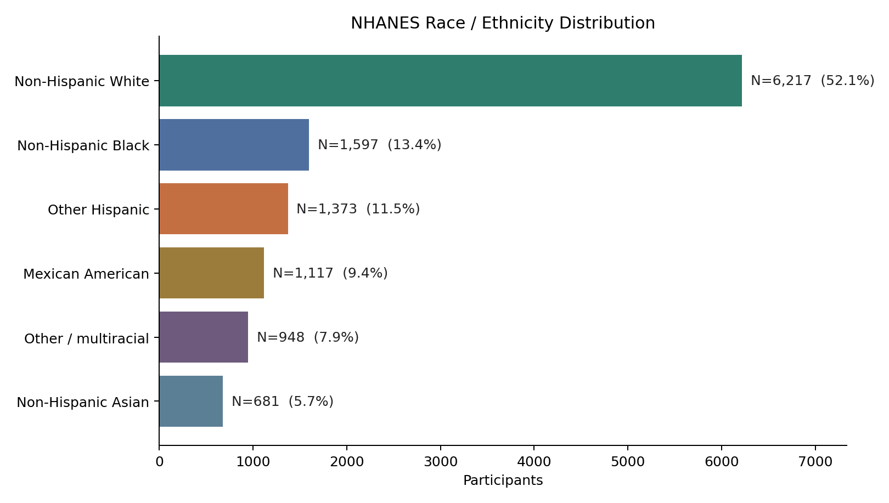
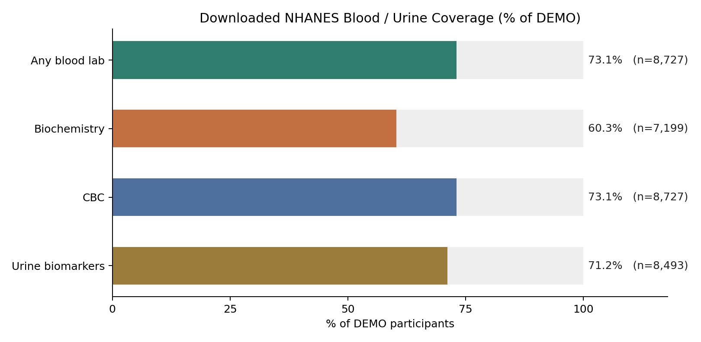
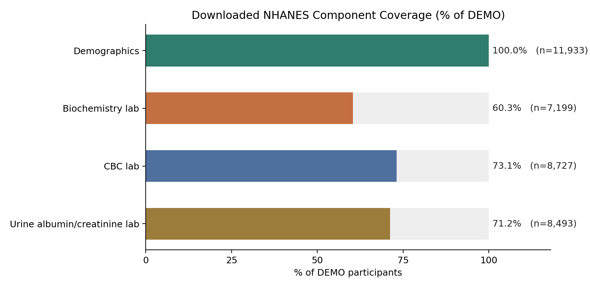

# Dataset Review for Tomorrow's Meeting

## Executive Summary

The current workspace contains four NHANES August 2021-August 2023 files: demographics, standard biochemistry blood profile, complete blood count, and urine albumin/creatinine. This is enough to show a strong NHANES prototype: demographic distributions, blood and urine biomarker coverage, and a user biomarker percentile comparison.

The current workspace does not contain CTD, ClinVar, questionnaire module files, or physical examination module files. For tomorrow, keep the focus on NHANES as the biomarker reference layer, while treating CTD and ClinVar as optional explanation/interpretation layers.

## Dataset Inventory and Product Role

| Dataset | Role | What it adds | Direct user linkage |
| --- | --- | --- | --- |
| NHANES | Population reference layer | Biomarker distributions and demographic comparison groups. | Yes, if user provides matching biomarker values. |
| CTD | Biological explanation layer | Chemical-gene, chemical-disease, gene-disease, pathway-style evidence links. | Indirect; use after a marker or exposure has been identified. |
| ClinVar | Genetic interpretation layer | Variant, gene, condition, clinical significance, review status. | Yes, if user has genetic variant input. |

## NHANES Deep Dive

### What the Current Files Contain

| File | Component | Rows | Unique participants | Coverage of DEMO |
| --- | --- | --- | --- | --- |
| DEMO_L.xpt | Demographics / interview + exam status | 11,933 | 11,933 | 100.0% |
| BIOPRO_L.xpt | Laboratory: standard biochemistry blood profile | 7,199 | 7,199 | 60.3% |
| CBC_L.xpt | Laboratory: complete blood count | 8,727 | 8,727 | 73.1% |
| ALB_CR_L.xpt | Laboratory: urine albumin and creatinine | 8,493 | 8,493 | 71.2% |

Key point for the meeting: NHANES examination data is not one single exam. It is a set of separate MEC examination and laboratory components. Each component has its own eligible sample, file, variables, and coverage. The downloaded files here cover demographics, two blood laboratory components, and one urine laboratory component, not all questionnaire/examination/laboratory modules.

### Participant Distribution

| Sex | Participants | Percent |
| --- | --- | --- |
| Male | 5575 | 46.7% |
| Female | 6358 | 53.3% |

| Race / ethnicity | Participants | Percent |
| --- | --- | --- |
| Mexican American | 1117 | 9.4% |
| Other Hispanic | 1373 | 11.5% |
| Non-Hispanic White | 6217 | 52.1% |
| Non-Hispanic Black | 1597 | 13.4% |
| Non-Hispanic Asian | 681 | 5.7% |
| Other / multiracial | 948 | 7.9% |

### Blood and Urine Biomarker Coverage

| Category | Participants | Percent of DEMO |
| --- | --- | --- |
| Any blood lab | 8727 | 73.1% |
| Biochemistry | 7199 | 60.3% |
| CBC | 8727 | 73.1% |
| Urine biomarkers | 8493 | 71.2% |

Interpretation: blood and urine biomarkers are available for large subsets, but not 100% of NHANES participants. Coverage should be calculated separately for each lab component.

### Examination / Laboratory Component Coverage

| Examination / lab category | Local file | Participants | Coverage |
| --- | --- | --- | --- |
| Demographics | DEMO_L.xpt | 11933 | 100.0% |
| Biochemistry lab | BIOPRO_L.xpt | 7199 | 60.3% |
| CBC lab | CBC_L.xpt | 8727 | 73.1% |
| Urine albumin/creatinine lab | ALB_CR_L.xpt | 8493 | 71.2% |

### Selected Biomarker-Level Coverage

| Biomarker | Column | Participants with value | Percent of DEMO |
| --- | --- | --- | --- |
| Glucose, serum (mg/dL) | LBXSGL | 6,357 | 53.3% |
| Total cholesterol, serum (mg/dL) | LBXSCH | 6,328 | 53.0% |
| Triglycerides, serum (mg/dL) | LBXSTR | 6,359 | 53.3% |
| Creatinine, serum (mg/dL) | LBXSCR | 6,326 | 53.0% |
| Uric acid, serum (mg/dL) | LBXSUA | 6,329 | 53.0% |
| Albumin, serum (g/dL) | LBXSAL | 6,366 | 53.3% |
| White blood cell count | LBXWBCSI | 7,593 | 63.6% |
| Hemoglobin (g/dL) | LBXHGB | 7,593 | 63.6% |
| Platelet count | LBXPLTSI | 7,593 | 63.6% |
| Albumin, urine (ug/mL) | URXUMA | 8,153 | 68.3% |
| Creatinine, urine (mg/dL) | URXUCR | 8,154 | 68.3% |
| Albumin/creatinine ratio, urine (mg/g) | URDACT | 8,153 | 68.3% |

## Feature Prototype Pipeline

Prototype workflow:

User input -> NHANES population comparison -> flag elevated/unusual biomarkers -> CTD biological explanation -> optional ClinVar genetic interpretation.

### 1. User Input

Simulated user: female, age 35, with blood and urine biomarkers plus an optional genetic variant (`BRCA1 c.68_69delAG`).

### 2. NHANES Population Reference Layer

The app compares each user biomarker with NHANES participants of the same sex and within +/- 5 years of age. Each comparison uses only participants who have that specific biomarker value.

| Biomarker | User value | Percentile | Population N | Median | P25-P75 | Interpretation |
| --- | --- | --- | --- | --- | --- | --- |
| Total cholesterol, serum (mg/dL) | 210 | 80.3 | 513 | 184.00 | 165.00 - 205.00 | Above average |
| Glucose, serum (mg/dL) | 95 | 69.6 | 513 | 90.00 | 85.00 - 96.00 | Typical range |
| Triglycerides, serum (mg/dL) | 150 | 78.8 | 514 | 96.50 | 71.25 - 138.00 | Above average |
| Creatinine, serum (mg/dL) | 0.85 | 84.0 | 513 | 0.72 | 0.64 - 0.81 | Above average |
| Hemoglobin (g/dL) | 13.0 | 41.2 | 534 | 13.10 | 12.40 - 13.90 | Typical range |
| Albumin/creatinine ratio, urine (mg/g) | 12.0 | 77.7 | 560 | 7.04 | 4.94 - 11.32 | Above average |

Flag rule for this prototype: mark biomarkers above the 75th percentile or below the 10th percentile as elevated/unusual for follow-up explanation. In the current simulated user, cholesterol, urine albumin/creatinine ratio, triglycerides, and serum creatinine are flagged.

### 3. CTD Biological Explanation Layer

| Flagged input | CTD query concept | Prototype explanation |
| --- | --- | --- |
| Total cholesterol: 80.3rd percentile | cholesterol | Retrieve lipid metabolism, cardiovascular disease, gene, and pathway evidence. |
| Triglycerides: 78.8th percentile | triglycerides | Retrieve triglyceride and cardiometabolic disease relationship evidence. |
| Serum creatinine: 84.0th percentile | creatinine / renal dysfunction | Retrieve kidney-function related chemical, gene, and disease evidence. |
| Urine ACR: 77.7th percentile | albuminuria / kidney disease | Retrieve renal injury, kidney disease, exposure, and gene association evidence. |

CTD is triggered by flagged biomarkers or related marker concepts. It explains possible chemical-gene-disease relationships from curated evidence; it should not be presented as direct personal prediction.

### 4. ClinVar Genetic Interpretation Layer

| Input | ClinVar use | App output |
| --- | --- | --- |
| User variant: BRCA1 c.68_69delAG | Look up variant-condition clinical significance and review status. | BRCA1 c.68_69delAG -> pathogenic; hereditary breast and ovarian cancer syndrome; show evidence/review status. |

ClinVar is triggered only if the user provides genetic variant data. Without user genetic input, this layer is skipped.

## Integration Framework

| Layer | Dataset | Purpose | Implementation note |
| --- | --- | --- | --- |
| User Data Layer | App input | User provides biomarker, lifestyle, or genetic data | Normalize units and collect age/sex/location where relevant |
| Reference Layer | NHANES | Compare user biomarkers to population distributions | Start with BIOPRO_L and CBC_L; add more lab modules later |
| Explanation Layer | CTD | Explain chemical-gene-disease/pathway evidence | Trigger from selected marker/exposure/gene |
| Genetic Layer | ClinVar | Interpret variant clinical significance | Only active when user has variant input |

## Current Challenge

These datasets do not share one universal participant ID or direct linkage key. The practical design is therefore layered, not a forced merge:

- NHANES supports direct biomarker reference comparisons.
- CTD supports mechanistic/evidence explanation.
- ClinVar supports variant interpretation when genetic data exists.

## Recommended Next Step

1. Keep NHANES as the first backend prototype because it already has local data and measurable coverage.
2. Download additional urine, exam, or questionnaire modules only if they support a concrete feature.
3. Add CTD and ClinVar as API/data lookup prototypes rather than core merged tables.

## Sources

- NHANES DEMO_L documentation: https://wwwn.cdc.gov/Nchs/Data/Nhanes/Public/2021/DataFiles/DEMO_L.htm
- NHANES BIOPRO_L documentation: https://wwwn.cdc.gov/Nchs/Data/Nhanes/Public/2021/DataFiles/BIOPRO_L.htm
- NHANES CBC_L documentation: https://wwwn.cdc.gov/Nchs/Data/Nhanes/Public/2021/DataFiles/CBC_L.htm
- NHANES ALB_CR_L documentation: https://wwwn.cdc.gov/Nchs/Data/Nhanes/Public/2021/DataFiles/ALB_CR_L.htm
- CTD update 2023: https://pubmed.ncbi.nlm.nih.gov/36169237/
- NCBI ClinVar overview: https://www.ncbi.nlm.nih.gov/clinvar/intro/
